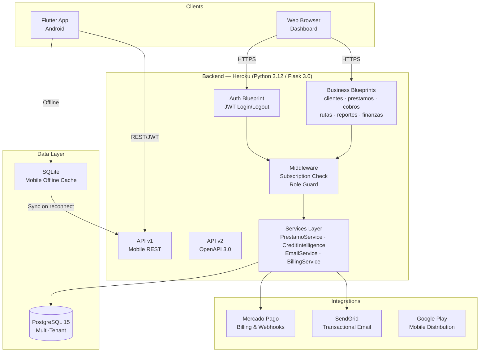
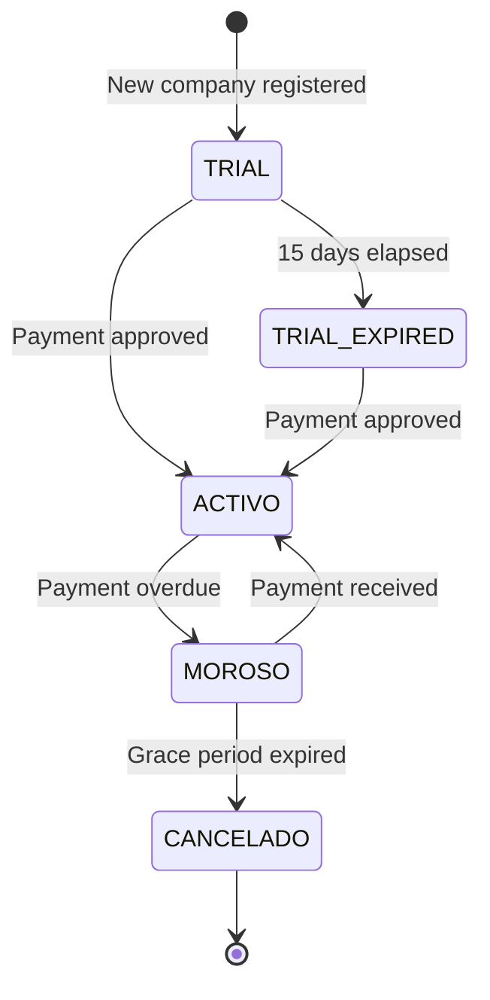

# System Architecture

## Overview

Diamante Pro follows a **multi-tenant SaaS architecture** where a single deployment serves multiple independent companies (tenants), each with complete data isolation enforced at the query layer.



---

## Multi-Tenancy Design

Every database query is scoped by `empresa_id`, which is embedded directly in the JWT payload at login time. This means:

- No middleware step needed to "switch tenant context"
- A misconfigured query returns empty results, not another tenant's data
- SUPER_ADMIN role bypasses this filter for cross-tenant analytics

```
JWT Payload
└── empresa_id: 42          ← injected at login
    role: "ADMIN"
    sub: "user_id"

Every SQLAlchemy query:
    .where(Model.empresa_id == current_user.empresa_id)
```

Security audit **v3.02** verified no cross-tenant data exposure across all 47 endpoints.

---

## Blueprint Structure

The app uses Flask's **factory pattern** (`create_app()`). Each blueprint owns one business domain:

| Blueprint | URL Prefix | Responsibility |
|---|---|---|
| `auth.py` | `/` | Login, logout, session management |
| `clientes.py` | `/clientes` | Client CRUD, profile, credit history |
| `prestamos.py` | `/prestamos` | Loan origination, approval workflow |
| `cobros.py` | `/cobro` | Collection management, payment recording |
| `rutas.py` | `/rutas` | Route assignment, collector management |
| `finanzas.py` | `/finanzas` | Cash reconciliation, financial reports |
| `reportes.py` | `/` | PDF/Excel report generation |
| `api.py` | `/api` | AJAX helpers for dashboard |
| `api_mobile.py` | — | v1 Mobile REST (legacy, read-only) |
| `api_openapi.py` | `/api/v2/` | v2 OpenAPI 3.0 (all new endpoints) |

---

## Subscription State Machine

A `before_request` hook enforces access based on the company's `estado_cuenta`:



---

## Inline Schema Migrations

Rather than Alembic, `create_app()` runs `ALTER TABLE … ADD COLUMN IF NOT EXISTS` at every startup. Each statement runs in its own savepoint so a single failure doesn't abort the rest. This enables zero-downtime deploys on Heroku without manual migration commands.

---

## Key Design Decisions

| Decision | Rationale |
|---|---|
| `empresa_id` on every table | Simplest tenant isolation — no schema-per-tenant complexity |
| JWT over session cookies | Stateless auth works identically for web and mobile |
| Services layer separated from blueprints | Business logic is testable without HTTP context |
| Dual API (v1 + v2) | v1 frozen for mobile compatibility; v2 evolves independently |
| SQLAlchemy 2.0 style only | Explicit sessions, no legacy `.query.` interface |
