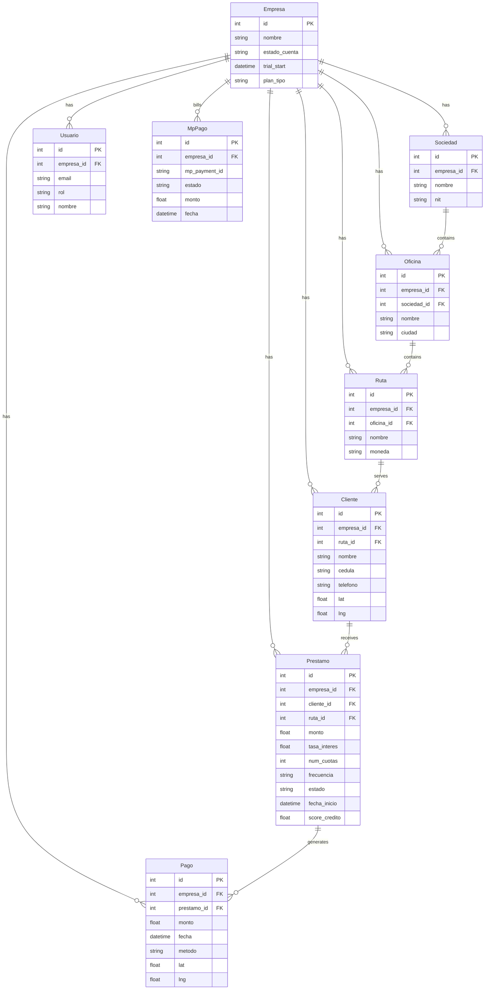
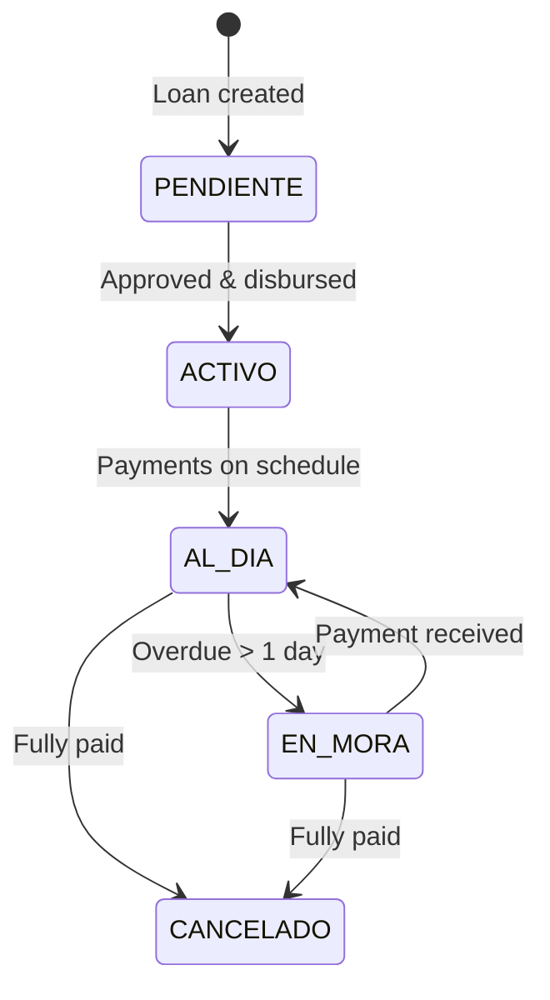

# Data Model

## Entity Hierarchy

Diamante Pro's data model follows a strict ownership chain. Every entity belongs to a company (`Empresa`), and `empresa_id` is present on every table to enforce multi-tenant isolation at the query layer.

```
Empresa
└── Sociedad (legal entity / holding)
    └── Oficina (branch office)
        └── Ruta (collection route)
            ├── Cobrador (field collector assigned to route)
            └── Cliente (borrower)
                └── Prestamo (loan)
                    └── Pago (payment installment)
```

---

## Entity Relationship Diagram



---

## Key Design Decisions

### empresa_id Denormalization

`empresa_id` is stored on every entity (not just `Empresa`). This is intentional:

- Avoids multi-table JOINs just to filter by tenant
- Allows adding indexes on `(empresa_id, <field>)` for fast tenant-scoped queries
- Makes accidental cross-tenant data leaks visible at the row level

### Route Dual-Strategy Query

The `get_rutas_empresa_query(empresa_id)` helper uses a dual-strategy to handle legacy routes created before the `Ruta.empresa_id` column existed:

```python
# Strategy 1: direct empresa_id match (modern rows)
# Strategy 2: via cobrador subquery (legacy rows without empresa_id)
# Result: UNION of both — no data loss during migration
```

### Loan State Machine



### Overdue Calculation

The canonical overdue calculation uses `_cuotas_esperadas_a_fecha()`, which compares **cumulative totals** from loan start date — not individual installment dates. This correctly handles:

- Irregular payment schedules
- Partial payments
- Rescheduled loans

### Geo-referenced Payments

`Pago` stores `lat`/`lng` at the moment of recording. This enables:

- Fraud detection (payment recorded 500km from client address)
- Route optimization analysis
- Field collector activity verification

---

## Subscription Model (`Empresa.estado_cuenta`)

| State | Access | Duration |
|---|---|---|
| `TRIAL` | Full access | 15 days from registration |
| `ACTIVO` | Full access | While subscription is paid |
| `MOROSO` | Read-only + warning | Grace period (configurable) |
| `CANCELADO` | Blocked, billing page only | Until reactivation |
| `PENDIENTE_SETUP` | Legacy state | — |
