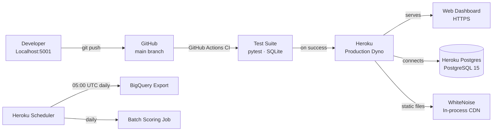

# Deployment

## Infrastructure Overview



---

## Heroku Configuration

### Runtime

Python version is declared in `.python-version` (Heroku reads this directly):
```
3.12.3
```

### Procfile

```
web: gunicorn wsgi:app
release: python scripts/run_startup_migrations.py
```

The `release` dyno runs schema migrations automatically on every deploy — no manual `heroku run` needed after adding columns.

### Connection Pool

```python
# Configured in create_app() for DATABASE_URL environments
pool_size=10
max_overflow=5
pool_recycle=1800  # seconds
```

### Static Files

WhiteNoise serves static assets directly from the web dyno — no separate CDN or S3 needed:

```python
app.wsgi_app = WhiteNoise(app.wsgi_app, root="app/static", prefix="static")
```

---

## CI/CD Pipeline (GitHub Actions)

```yaml
name: CI

on: [push, pull_request]

jobs:
  test:
    runs-on: ubuntu-latest
    steps:
      - uses: actions/checkout@v4
      - uses: actions/setup-python@v5
        with:
          python-version: '3.12'
      - run: pip install -r requirements.txt
      - run: pytest tests/ -v --tb=short
```

Tests run on every push. Heroku auto-deploys from `main` only when all checks pass.

---

## Schema Migration Strategy

Diamante Pro avoids Alembic in favor of inline startup migrations:

```python
# In create_app() — runs on every dyno startup
MIGRATIONS = [
    "ALTER TABLE cliente ADD COLUMN IF NOT EXISTS lat FLOAT",
    "ALTER TABLE cliente ADD COLUMN IF NOT EXISTS lng FLOAT",
    "ALTER TABLE prestamo ADD COLUMN IF NOT EXISTS score_credito FLOAT",
    # ... additional columns
]

for stmt in MIGRATIONS:
    with db.engine.begin() as conn:
        conn.execute(text(stmt))
```

**Why this approach:**
- Compatible with both SQLite (dev) and PostgreSQL (prod)
- Zero-downtime: `IF NOT EXISTS` makes statements idempotent
- No migration state files to manage or conflict-resolve
- Each statement runs in its own savepoint — one failure doesn't abort the rest

---

## Environment Variables

| Variable | Purpose | Required |
|---|---|---|
| `SECRET_KEY` | Flask session signing | Yes |
| `JWT_SECRET_KEY` | JWT token signing | Yes |
| `DATABASE_URL` | PostgreSQL connection string | Yes (prod) |
| `SENDGRID_API_KEY` | Transactional email | Yes (prod) |
| `SENDGRID_FROM_EMAIL` | Sender address | Yes (prod) |
| `MERCADOPAGO_ACCESS_TOKEN` | Billing webhooks | Yes (prod) |
| `MERCADOPAGO_WEBHOOK_SECRET` | HMAC-SHA256 webhook verification | Yes (prod) |
| `APP_DOMAIN` | Base URL for email links | Yes (prod) |
| `OPENAPI_USER` / `OPENAPI_PASS` | Basic Auth on `/openapi/` docs | Optional |

In development, omitting `DATABASE_URL` falls back to SQLite automatically.

---

## Scheduled Jobs (Heroku Scheduler)

| Job | Schedule | Description |
|---|---|---|
| `scripts/batch_scoring_job.py` | Daily | Recalculates credit scores for all active loans |
| `scripts/etl_bigquery_export.py` | 05:00 UTC | Exports anonymized data to BigQuery for ML training |

---

## Mobile Distribution

The Flutter Android app is distributed via **Google Play** (beta track):

- **Package**: `com.diamantepro.app`
- **Store**: [Google Play](https://play.google.com/store/apps/details?id=com.diamantepro.app)
- **Track**: Internal testing → Closed beta → Production

Build and release process:
```bash
flutter build apk --release
# Upload to Play Console via GitHub Actions or manually
```

---

## Local Development Setup

```bash
# 1. Clone and install dependencies
git clone git@github.com:graciano90210/DIAMANTE-PRO.git
cd DIAMANTE-PRO
pip install -r requirements.txt

# 2. Initialize local database
python scripts/crear_tablas_sqlite.py
python scripts/crear_admin.py

# 3. Run development server
python run.py
# → http://localhost:5001
```
