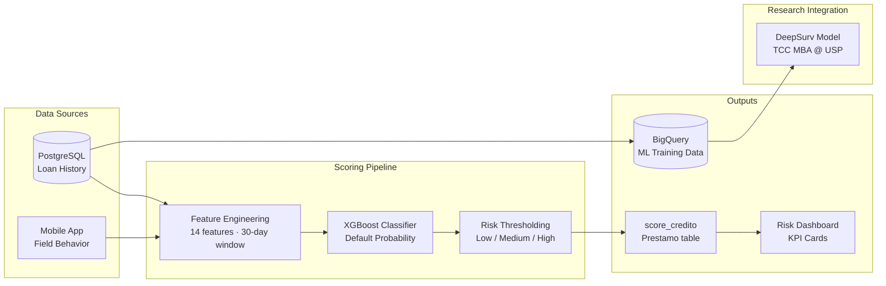
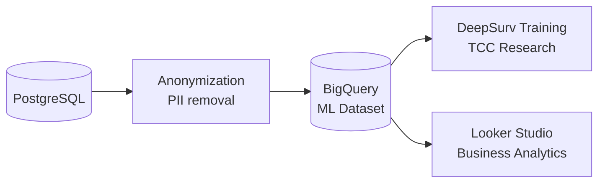

# ML Pipeline — Credit Intelligence

## Overview

Diamante Pro includes a production-grade credit intelligence module that scores loans in real time using an XGBoost classifier. The scoring pipeline is also designed to feed the companion deep survival analysis research project.

---

## Architecture



---

## Feature Set (14 Features)

The model operates on a **30-day rolling window** (`VENTANA_DIAS = 30`) to capture recent behavioral signals:

| Feature | Description | Type |
|---|---|---|
| `MONTO` | Original loan amount | Numeric |
| `SALDO` | Remaining balance | Numeric |
| `saldo_actual` | Current balance (recalculated) | Numeric |
| `TASA` | Interest rate | Numeric |
| `NUM_CUOTAS` | Total installments | Numeric |
| `CUOTAS_PAGADAS` | Installments paid to date | Numeric |
| `DIAS_MORA` | Days overdue | Numeric |
| `VALOR CUOTA` | Installment amount | Numeric |
| `valor_cuota` | Installment amount (recalculated) | Numeric |
| `PAGOS_30D` | Payments in last 30 days | Numeric |
| `MONTO_PAGADO_30D` | Amount paid in last 30 days | Numeric |
| `CUOTAS_ESPERADAS` | Expected installments by today | Numeric |
| `RATIO_CUMPLIMIENTO` | Payment compliance ratio | Numeric (0–1) |
| `HISTORIAL_MORA` | Previous delinquency count | Numeric |

> Note: `SALDO`/`saldo_actual` and `VALOR CUOTA`/`valor_cuota` are intentional duplicate pairs retained for model compatibility until retraining (Fase B).

---

## Overdue Calculation — The Canonical Method

A critical design detail: overdue installments are calculated by comparing **cumulative totals**, not individual due dates.

```python
def _cuotas_esperadas_a_fecha(prestamo, fecha_corte):
    """
    Compares cumulative expected vs actual payments from loan start.
    Both operands are on the same temporal basis — avoids drift with
    irregular payment schedules or partial payments.
    """
    dias_transcurridos = (fecha_corte - prestamo.fecha_inicio).days
    if prestamo.frecuencia == "diaria":
        return dias_transcurridos
    elif prestamo.frecuencia == "semanal":
        return dias_transcurridos // 7
    elif prestamo.frecuencia == "quincenal":
        return dias_transcurridos // 15
    elif prestamo.frecuencia == "mensual":
        return dias_transcurridos // 30
```

---

## Risk Classification

Scores are mapped to risk tiers used throughout the dashboard:

| Score Range | Classification | Action |
|---|---|---|
| `0.80 – 1.00` | Low Risk | Auto-approve eligible |
| `0.50 – 0.79` | Medium Risk | Manual review recommended |
| `0.20 – 0.49` | High Risk | Additional collateral required |
| `0.00 – 0.19` | Very High Risk | Reject or senior approval only |

Mora severity thresholds are shared constants used across services:

```python
MORA_ATRASO_MIN = 1   # First alert
MORA_ALERTA_MIN = 3   # Warning state
MORA_GRAVE_MIN  = 4   # Critical — escalate
```

---

## Batch Scoring Job

A Heroku Scheduler job (`scripts/batch_scoring_job.py`) runs daily to:

1. Query all active loans
2. Recalculate 14 features per loan
3. Run XGBoost inference
4. Update `Prestamo.score_credito` in bulk
5. Trigger alerts for loans that crossed risk thresholds overnight

---

## BigQuery Export Pipeline

`scripts/etl_bigquery_export.py` runs at 05:00 UTC daily to export anonymized loan data to BigQuery:



The BigQuery schema is pre-structured to match the feature set required by the companion survival analysis model.

---

## Companion Research Project

> **[Credit Risk Modeling via Deep Survival Analysis](https://github.com/graciano90210/tcc-mba-survival-analysis)**

This TCC (MBA Data Science @ USP/ICMC) research project extends Diamante Pro's credit scoring with survival analysis techniques:

- **Cox Proportional Hazards** — baseline parametric survival model
- **DeepSurv** — neural network extension of Cox model
- **Dataset**: 28,386 real microcredit records (anonymized)
- **Target**: Time-to-default prediction, not just binary classification

The production integration path: DeepSurv scores replace XGBoost scores in `Prestamo.score_credito` once the model passes validation on held-out data.
